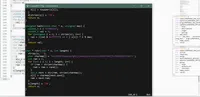
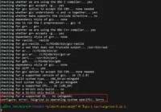
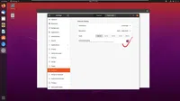

<table width="100%" border="0" cellpadding="30" cellspacing="0" bgcolor="transparent" align="left" frame="void">

<tr data-timestamp="1604541022.801083" data-id="RIHFVogPhC">
<td width="150" align="right">2020-11-05 09:50 #RIHFVogPhC</td>
<td>

TkDocs 是他媽的什麼垃圾？？

上次看還一切正常，爲什麼總有人能把東西越更新越垃圾

</td><!-- ITEM-END -->
</tr>

<tr data-timestamp="1604195253.416941" data-id="5KYw3zHWCb">
<td width="150" align="right">2020-11-01 09:47 #5KYw3zHWCb</td>
<td>

每日一咒，微軟爆炸

</td><!-- ITEM-END -->
</tr>

<tr data-timestamp="1603383966.32663" data-id="YRHBkpNLFr">
<td width="150" align="right">2020-10-23 00:26 #YRHBkpNLFr</td>
<td>

愚蠢是宿命

</td><!-- ITEM-END -->
</tr>

<tr data-timestamp="1602581687.142866" data-id="u2j6Pc8gez">
<td width="150" align="right">2020-10-13 17:34 #u2j6Pc8gez</td>
<td>

把系統搞崩過一次之後，怕了

</td><!-- ITEM-END -->
</tr>

<tr data-timestamp="1602549437.029547" data-id="yehDJjeBXe">
<td width="150" align="right">2020-10-13 08:37 #yehDJjeBXe</td>
<td>

我嚴重懷疑華師拆掉了學校裏面的大部分移動基站，一課的移動網路也只有 2G 的速度了

</td><!-- ITEM-END -->
</tr>

<tr data-timestamp="1602306739.537336" data-id="AzxMDelbCH">
<td width="150" align="right">2020-10-10 13:12 #AzxMDelbCH</td>
<td>

當你試圖在 Windows 上編譯開源軟體的源程式碼...

</td><!-- ITEM-END -->
</tr>

<tr data-timestamp="1602242540.984072" data-id="EQuwUgmRP4">
<td width="150" align="right">2020-10-09 19:22 #EQuwUgmRP4</td>
<td>

Attending lessons is a torture

</td><!-- ITEM-END -->
</tr>

<tr data-timestamp="1602147160.566781" data-id="lVrtr7pVC6">
<td width="150" align="right">2020-10-08 16:52 #lVrtr7pVC6</td>
<td>

調單車前撥的方式是調上面兩個帶彈簧的螺絲，不是調傳動線，這跟後撥不一樣，記住了
嗎🌚

<blockquote><a href="//github.com/li-zyang">li-zyang</a>:
在樓下倒騰了一下午被氣到罵一百遍這玩意的設計師終於發現了這個機關.fine
</blockquote>
</td><!-- ITEM-END -->
</tr>

<tr data-timestamp="1601812186.638584" data-id="RPQc5490rm">
<td width="150" align="right">2020-10-04 19:49 #RPQc5490rm</td>
<td>

死媽校領導，祝您家裏以後天天停電，這樣您就再也不需要交電費了

</td><!-- ITEM-END -->
</tr>

<tr data-timestamp="1601545412.375826" data-id="pDDQhwCaWh">
<td width="150" align="right">2020-10-01 17:43 #pDDQhwCaWh</td>
<td>

久聞大名的陶園黒椒意麪，竟然

並 不 怎 麼 辣 ？

</td><!-- ITEM-END -->
</tr>

<tr data-timestamp="1601473716.55125" data-id="G1qdm6f9Cd">
<td width="150" align="right">2020-09-30 21:48 #G1qdm6f9Cd</td>
<td>

下午下課遇到一個一眼看過去認識的人，她認出我來了，但是我怎麼都沒法完全確定是誰。
準確地說從開學到現在我已經遇到過好幾次這樣感覺是某個人但是又不敢完全確定的情況
了，下午那個情景一直到現在都揮之不去，好像我過了一個學期把所有人都忘記了一樣

我真的很努力地想要記住那些與我有過交集的人的樣子，但是到最後發現自己對於所有人
的記憶都還是模糊的

</td><!-- ITEM-END -->
</tr>

<tr data-timestamp="1601397305.244869" data-id="r3WM6OTXx5">
<td width="150" align="right">2020-09-30 00:35 #r3WM6OTXx5</td>
<td>

就尼瑪離譜...

</td><!-- ITEM-END -->
</tr>

<tr data-timestamp="1601035564.595442" data-id="4e1hHphDHj">
<td width="150" align="right">2020-09-25 20:06 #4e1hHphDHj</td>
<td>

簡單的問題詳細講，複雜的問題簡單講

</td><!-- ITEM-END -->
</tr>

<tr data-timestamp="1600910640.097103" data-id="DLKSvxeEqL">
<td width="150" align="right">2020-09-24 09:24 #DLKSvxeEqL</td>
<td>

技術的應用越來越走向了一個讓每一個人都無處可藏的未來，從無處不在的監控攝像頭和
安檢機，越來越多實名認證，難以放下的手機，到絞盡腦汁給用戶打標籤、下定義的廣告
商，To-C 企業都趨之若鶩的數據挖掘和大數據分析，越來越快速同步且廣泛的數據販賣，
再到準確率越來越高、應用越來越廣的人工智能，無不像跟蹤疑犯似地跟蹤着每一個人。

我願意相信提出這個設想的人是希望爲更多人提供關懷的，也許在僅僅十年前的人類社會，
一種立即的關懷是令人欣慰和感動的，因爲那代表了一個人被周圍人關注着，而不是被忽
視甚至孤立，但當這種關懷的主體在今天從人變成機器，變成一些可以計算的東西的時候，
難道不會讓人覺得很奇怪嗎？

 
<blockquote><a href="//github.com/li-zyang">li-zyang</a>:
倒也不是說反技術，只是我覺得技術應該用在正確的地方，而不是用來建一個越來越嚴密
的囚籠，然後將越來越多的人加入進去，這真的會是一件很恐怖的事情
</blockquote>
</td><!-- ITEM-END -->
</tr>

<tr data-timestamp="1600849354.538597" data-id="8DKJIZzZar">
<td width="150" align="right">2020-09-23 16:22 #8DKJIZzZar</td>
<td>

一課的校園網又炸了，垃圾校領導又想要政績又不願意投入資源，傻逼

</td><!-- ITEM-END -->
</tr>

<tr data-timestamp="1600671183.690183" data-id="9rgl6k1wa5">
<td width="150" align="right">2020-09-21 14:53 #9rgl6k1wa5</td>
<td>

還是完蛋

</td><!-- ITEM-END -->
</tr>

<tr data-timestamp="1600533783.60888" data-id="zHJrV0XXNI">
<td width="150" align="right">2020-09-20 00:43 #zHJrV0XXNI</td>
<td>

倒騰了幾天 C++，終於深刻感受到了人們對它的嫌棄

沒別的，STL 和 GDB 真的是一坨狗屎，再加上毫無規範的語言風格

Oh, fuck

</td><!-- ITEM-END -->
</tr>

<tr data-timestamp="1600408540.429065" data-id="YbiKRK7UaF">
<td width="150" align="right">2020-09-18 13:55 #YbiKRK7UaF</td>
<td>

妙啊

可惜應該還是不能在沒有校準儀的情況下大概校準色彩這種功能

</td><!-- ITEM-END -->
</tr>

<tr data-timestamp="1600347971.979981" data-id="neXkAN5EY">
<td width="150" align="right">2020-09-17 21:06 #neXkAN5EY</td>
<td>

</td><!-- ITEM-END -->
</tr>

<tr data-timestamp="1600338287.309836" data-id="tZnqaQNSyc">
<td width="150" align="right">2020-09-17 18:24 #tZnqaQNSyc</td>
<td>

我出來了✓妙啊😏

</td><!-- ITEM-END -->
</tr>

<tr data-timestamp="1600302228.801118" data-id="VMiwGKjvSy">
<td width="150" align="right">2020-09-17 08:23 #VMiwGKjvSy</td>
<td>

在華師，體驗早上七點鐘被窗外的施工隊吵醒

<blockquote><a href="//github.com/li-zyang">li-zyang</a>:
想要報華師的人在學校管理層大換血之前還是再等等吧hhh
</blockquote>
</td><!-- ITEM-END -->
</tr>

<tr data-timestamp="1600270062.987691" data-id="4gQnxEK4E3">
<td width="150" align="right">2020-09-16 23:27 #4gQnxEK4E3</td>
<td>

=> 48H

<blockquote><a href="//github.com/li-zyang">li-zyang</a>:
有、暈了
</blockquote>
</td><!-- ITEM-END -->
</tr>

<tr data-timestamp="1600093610.036086" data-id="v3bCYT2mll">
<td width="150" align="right">2020-09-14 22:26 #v3bCYT2mll</td>
<td>

什麼事情遇上下雨天都會變壞

什麼垃圾天氣天天下雨還有完沒完了

</td><!-- ITEM-END -->
</tr>

<tr data-timestamp="1599699616.213252" data-id="SOfb834r27">
<td width="150" align="right">2020-09-10 09:00 #SOfb834r27</td>
<td>

現在的媒體過度宣傳的所謂“正能量”反倒讓人感到麻木，因為新聞報導裏所描述的世界
與現實中看到的世界並不一致，於是會讓人感覺到不真實，尤其是對於那些與某一篇報道
具有相似經歷的人，當他們在現實中卻並沒有被同樣或相似地對待的時候，落差感則會更
加明顯。以政治宣傳爲目的的報道實際上已經偏離了新聞本身的目的，其對倖存者偏差的
模糊化讓人們更加不那麼能夠理性地去看待一個新聞，變得更加情緒化

</td><!-- ITEM-END -->
</tr>

<tr data-timestamp="1599665904.577071" data-id="bZIeiwEKfB">
<td width="150" align="right">2020-09-09 23:38 #bZIeiwEKfB</td>
<td>

世界上又怎么会有这么多慷慨的人呢

 
</td><!-- ITEM-END -->
</tr>

<tr data-timestamp="1599627278.475649" data-id="VjqqUzGXej">
<td width="150" align="right">2020-09-09 12:54 #VjqqUzGXej</td>
<td>

 
</td><!-- ITEM-END -->
</tr>

<tr data-timestamp="1599531723.763015" data-id="VTqiLlnBFz">
<td width="150" align="right">2020-09-08 10:22 #VTqiLlnBFz</td>
<td>

在華師，體驗 4G 網絡下的 2G 網速

</td><!-- ITEM-END -->
</tr>

<tr data-timestamp="1599482744.237062" data-id="pGMFXeMQDh">
<td width="150" align="right">2020-09-07 20:45 #pGMFXeMQDh</td>
<td>

保安大概是世界上所有正經職業裏面最流氓最令人討厭的一種了

</td><!-- ITEM-END -->
</tr>

<tr data-timestamp="1599471364.141135" data-id="URkAtHCS92">
<td width="150" align="right">2020-09-07 17:36 #URkAtHCS92</td>
<td>

這個破學校的教工什麼時候才能死光啊

把一輛上了鎖的單車移一百多米您不累嗎，您不累我 TM 找得還累呢操你媽的

那地方我停過去的時候旁邊還有幾輛老師的電動車呢吧，您怎麼不把它們移走呢，怎麼我
下課過去還看到它們在那呢

破學校除了會給學生找麻煩還會幹什麼喔

一課是全華師最好看的地方，但是也是全華師最骯髒的地方（哦如果說人的話那應該是行
政樓了）

華南師範大學，誰報誰後悔

行政樓門前已經裝飾得越來越像墳場了，祝它早日變成真正的墳場

<blockquote><a href="//github.com/li-zyang">li-zyang</a>:
東座一樓兩間教室都有人上課，有不開空調又不開燈也不知道這些人是想幹嘛
</blockquote><blockquote><a href="//github.com/li-zyang">li-zyang</a>:
華南官僚大學實錘
</blockquote>
</td><!-- ITEM-END -->
</tr>

<tr data-timestamp="1599439485.908344" data-id="b5BqlOzoMH">
<td width="150" align="right">2020-09-07 08:44 #b5BqlOzoMH</td>
<td>

開學第一天，升旗、下暴雨、摔一身水、第一節課遲到還被老師發現

我看這個學期也不會好了

<blockquote><a href="//github.com/li-zyang">li-zyang</a>:
這天氣不是下雨淋一身水去哪都不方便就是出門被熱出一身汗，你乾脆把我直接淹死算了md
</blockquote><blockquote><a href="//github.com/li-zyang">li-zyang</a>:
我看這場雨就是專門爲了給我帶來一早上的麻煩而下的，早上剛到教室沒多久雨就停了，
然後一直都保持着不出太陽也不下雨的狀態，等我下課回宿舍的時候就出大太陽
</blockquote>
</td><!-- ITEM-END -->
</tr>

<tr data-timestamp="1599369698.547204" data-id="KLleabHfWu">
<td width="150" align="right">2020-09-06 13:21 #KLleabHfWu</td>
<td>

好無聊啊

</td><!-- ITEM-END -->
</tr>

<tr data-timestamp="1599305434.830941" data-id="kdDvNzjFvi">
<td width="150" align="right">2020-09-05 19:30 #kdDvNzjFvi</td>
<td>

擴散...淦

 
</td><!-- ITEM-END -->
</tr>

<tr data-timestamp="1599299801.593682" data-id="wB90SpYrav">
<td width="150" align="right">2020-09-05 17:56 #wB90SpYrav</td>
<td>

現在的領導已經退化到點數都點不清楚了呢

</td><!-- ITEM-END -->
</tr>

<tr data-timestamp="1599217882.479271" data-id="NLd1HUM25o">
<td width="150" align="right">2020-09-04 19:11 #NLd1HUM25o</td>
<td>

不聚集 -> 團日活動必須線下進行

</td><!-- ITEM-END -->
</tr>

<tr>
<td width="150" align="right">2020-09-03 00:02 #GyXxZ38ZWu</td>
<td>

手指廢掉

</td><!-- ITEM-END -->
</tr>

<tr>
<td width="150" align="right">2020-08-31 19:30 #d6N4ZrOHfB</td>
<td>

抓住暑假的尾巴，再逛一逛繁華的廣州

打卡：薩利亞的餐還挺好吃，不算太貴

</td><!-- ITEM-END -->
</tr>

<tr>
<td width="150" align="right">2020-08-31 09:38 #c7O9A7aU75</td>
<td>

不聚集 -> 只開一個驛站

不愧是校領導（也許西區驛站在校園內南區驛站在校園外所以？

</td><!-- ITEM-END -->
</tr>

<tr>
<td width="150" align="right">2020-08-30 23:04 #0fx2FWQnUF</td>
<td>

正式開學前可以出去還是 OK 的，不過不知道多久之後才能恢復征程通行

</td><!-- ITEM-END -->
</tr>

<tr>
<td width="150" align="right">2020-08-30 17:49 #FoebCfx1Gm</td>
<td>

整理宿舍整理到天荒地老，感覺像是住進了一棟廢棄的樓一樣

</td><!-- ITEM-END -->
</tr>

<tr>
<td width="150" align="right">2020-08-29 23:59 #RCG314KlPv</td>
<td>

我準備好了👌

</td><!-- ITEM-END -->
</tr>

<tr>
<td width="150" align="right">2020-08-28 21:20 #DgOLAXeAxb</td>
<td>

CODING 真香

這容量快趕上某度網盤了

</td><!-- ITEM-END -->
</tr>

<tr>
<td width="150" align="right">2020-08-28 15:03 #zb1Xeg7n7I</td>
<td>

一個破返校申請得搞來搞去交三次，有什麼東西自己又不說清楚

一個破 file 不會把多文件打開嗎？上傳附件您這到底是文本還是按鈕呢？還有 PDF 是
您自己放上去的吧，最後怎麼又不要上傳 PDF 了呢？什麼叫做命名一目瞭然，您 TM 倒
是說清楚怎麼命名啊？前一句說圖片大小不超過 3MB，後一句又說不要壓縮圖片，前端壓
縮圖片幾行代碼不會寫是嗎？要不要我給您發過去啊？？還有上傳附件出錯返回的網頁 
MIMEType 都錯了，而且還不知道用得什麼鬼編碼，一堆亂碼（沒截圖），您真是善於方
便自己麻煩別人呢

還有昨天看到一篇文章說的某些高校封閉式管理就是學生要來來回回申請半天才能進出校
門，教工卻自由進出，我看有你華南師範大學一個吧？教育部的回應倒是牛逼，妥妥的給
各校校領導洗白，怎麼沒見教工進出要申請半天呢？？

</td><!-- ITEM-END -->
</tr>

<tr>
<td width="150" align="right">2020-08-26 20:21 #SWrGkyM4kb</td>
<td>

睡眠不足警告 + 有毒煙塵吸入警告

瑟瑟發抖

</td><!-- ITEM-END -->
</tr>

<tr>
<td width="150" align="right">2020-08-26 02:12 #IfIQ43YU7u</td>
<td>

原來七夕已經過了啊😂笑死（渾然不覺的我😂

</td><!-- ITEM-END -->
</tr>

<tr>
<td width="150" align="right">2020-08-25 23:34 #04oTS63tZF</td>
<td>

一次看個夠，還在宣揚什麼孝順的人可認清現實吧

</td><!-- ITEM-END -->
</tr>

<tr>
<td width="150" align="right">2020-08-25 21:00 #kuSCgiBreG</td>
<td>

</td><!-- ITEM-END -->
</tr>

<tr>
<td width="150" align="right">2020-08-25 16:29 #u1JWetvIer</td>
<td>

窗外馬路上的落葉和大風突然讓我想起來高中在校道上面吹着略帶一點寒意的秋風的感覺，
那樣的風吹在臉上的感覺很真實，讓人真實地感覺自己站在這個世界上，被周圍的一切所
簇擁着

</td><!-- ITEM-END -->
</tr>

<tr>
<td width="150" align="right">2020-08-24 23:06 #kQZqf4jZkJ</td>
<td>

華師的服務真的是日常出 bug ... 我改你🐴呢

</td><!-- ITEM-END -->
</tr>

<tr>
<td width="150" align="right">2020-08-24 01:43 #GG8tnEdcfE</td>
<td>

返校倒計時七天

</td><!-- ITEM-END -->
</tr>

<tr>
<td width="150" align="right">2020-08-23 15:37 #IdF57WKjFo</td>
<td>

微軟寧是真牛逼哈，一天不做妖會死？

神 TM 無法查看所有者，刪個文件都能給你刪死了

<blockquote><a href="//github.com/li-zyang">li-zyang</a>:
紧接着系统界面就开始出各种 bug
</blockquote><blockquote><a href="//github.com/li-zyang">li-zyang</a>:
然后重启进 PE 之后发现这个文件早就从文件系统上被删除了
</blockquote><blockquote><a href="//github.com/li-zyang">li-zyang</a>:
你说刺激不刺激
</blockquote>
</td><!-- ITEM-END -->
</tr>

<tr>
<td width="150" align="right">2020-08-22 19:57 #EmR2I0wb9K</td>
<td>

這是八月份的 6000 字／天

</td><!-- ITEM-END -->
</tr>

<tr>
<td width="150" align="right">2020-08-22 09:29 #G2cDKkluar</td>
<td>

今天又發現一個自己跟別人不一樣的地方呢

不只是爺爺奶奶，親媽也會這麼想，而且還很自豪呢

</td><!-- ITEM-END -->
</tr>

<tr>
<td width="150" align="right">2020-08-21 19:16 #606CPH9JRF</td>
<td>

被全世界圍攻的一天

</td><!-- ITEM-END -->
</tr>

<tr>
<td width="150" align="right">2020-08-21 12:49 #OhybzdTnQ9</td>
<td>

你永遠都祗是“說了幾句”，所以錯誤總是在別人身上

</td><!-- ITEM-END -->
</tr>

<tr>
<td width="150" align="right">2020-08-20 23:26 #if573gw8yz</td>
<td>

生活艱難吶

</td><!-- ITEM-END -->
</tr>

<tr>
<td width="150" align="right">2020-08-17 21:18 #wUeB0XXpdk</td>
<td>

又搞起 PIL 來了

就是以前用過的東西全忘了

</td><!-- ITEM-END -->
</tr>

<tr>
<td width="150" align="right">2020-08-16 15:11 #ArW7U3aGhr</td>
<td>

早上費力半天勁把家裏的傻逼書櫃拉出來拿後面的東西，搞了一個多小時，好不容易弄完
了回來打開個 Photoshop 處理張圖片結果剛打開就報錯異常退出，還把 Firefox 也搞
崩了，重啓沒多久又崩一次，好不容易把這些破事搞完結果發現 Tampermonkey 在石墨
文檔上又沒法正常運行了，而且還找不到原因，下午喝個酸奶結果一撕包裝直接質壁分離
了，洗個杯子結果杯子直接從橡膠套裏面脫出來摔碎了

真 TM 好一天

</td><!-- ITEM-END -->
</tr>

<tr>
<td width="150" align="right">2020-08-15 22:46 #Y6Aa3j19eL</td>
<td>

你 TM 杀了我吧

</td><!-- ITEM-END -->
</tr>

<tr>
<td width="150" align="right">2020-08-15 13:57 #eV9AWz8Z1b</td>
<td>

搞吧，使勁搞吧，反正永遠都是“你們”家

</td><!-- ITEM-END -->
</tr>

<tr>
<td width="150" align="right">2020-08-14 20:23 #WGeDyBLQKd</td>
<td>

做啥都專心不下來的一天

一個看起來挺小的 Proj 拖了一個多月，再不搞完都要開學了。心態爆炸。

</td><!-- ITEM-END -->
</tr>

<tr>
<td width="150" align="right">2020-08-13 20:42 #0UQIc0neIH</td>
<td>

什么狗屎网络今天

</td><!-- ITEM-END -->
</tr>

<tr>
<td width="150" align="right">2020-08-13 10:35 #6Xa5jAGUBg</td>
<td>

我发现街区派出所的面子工程简直是完美的闹钟，一听到就醒 
拿来当闹钟铃声了✓

<audio controls="true">
  <source src="src/CvqqQ1mYCd.mp3">
</audio>
</td><!-- ITEM-END -->
</tr>

<tr>
<td width="150" align="right">2020-08-10 14:31 #QeZK2JOgnF</td>
<td>

md 
千万别买 <a href="https://www.socketpro.site/zh/home">Socket Pro</a> 的服务，坑死 
都 0202 年 8 月了还只支持 SSR，客服态度还横的一批

</td><!-- ITEM-END -->
</tr>

<tr>
<td width="150" align="right">2020-08-10 14:31 #Iyg7tA9p9b</td>
<td>

想睡着难，想起床难，想不起床也难 
真难

</td><!-- ITEM-END -->
</tr>

<tr>
<td width="150" align="right">2020-08-08 16:16 #GQyTOWICx</td>
<td>

傻逼公司做的东西真的是越来越弱智，TMD 现在移动应用也不知道是在往什么有毒的方向
发展，总喜欢没事找事去做些多余的东西，要不就是把什么东西都隐藏起来，搞得手机越
来越 JB 难用

什么叫没有安装可以打开该文件的应用？谁让你自己去判断了？？系统没提供通过默认程
序打开文件的功能吗？？有你 TM 用系统自带的行不行？？
你 TM 文件好好放个地方实在不行全放 Downloads 里面行不行？以前找半天好歹还找得
到，现在放文件的地方都没有了，你上辈子跟文件路径有仇是不？那我要你那个傻逼文件
传输助手是干嘛的？

还有些傻逼应用涉及到一点不呆逼的功能直接没有，还有某平台上的大多数应用设置里面
就一个关于，那你妈逼的还不如直接放个关于算了呢

还有我发个文件文件空不空关你屁事？我叫你检查文件内容了吗？？

还有有事没事就叫人安装个 App 这种鬼风气，你 TM 的 App 很好看咩？？一点小功能
用 Web 会死是不是？还有些只做手机端不做 PC 端的我真是祝您早日爆炸💥

</td><!-- ITEM-END -->
</tr>

<tr>
<td width="150" align="right">2020-08-07 14:05 #kKakAEwZuH</td>
<td>

............................... 72 ch rl ............................... 
OK =_= 有啥逼話發這算了 
有事 issue 見

</td><!-- ITEM-END -->
</tr>

</table><!-- IDLERY-END -->