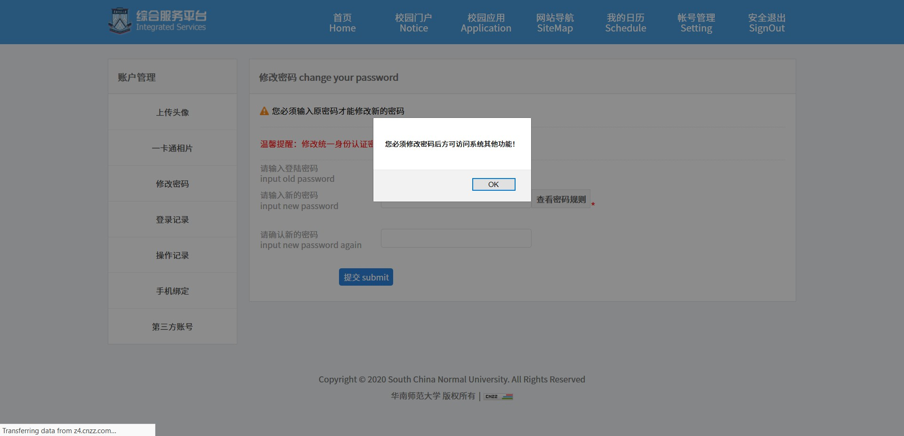
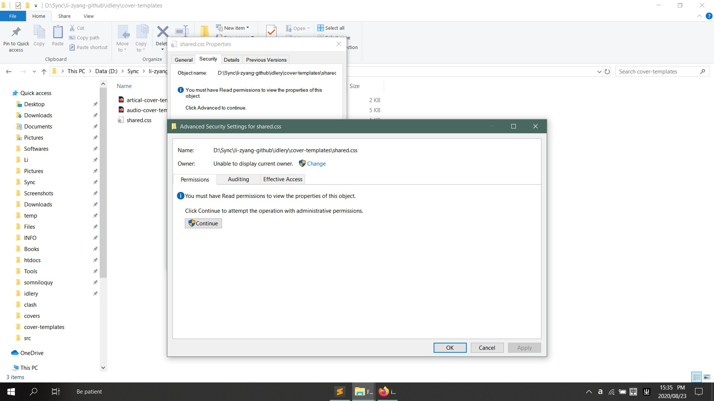
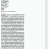
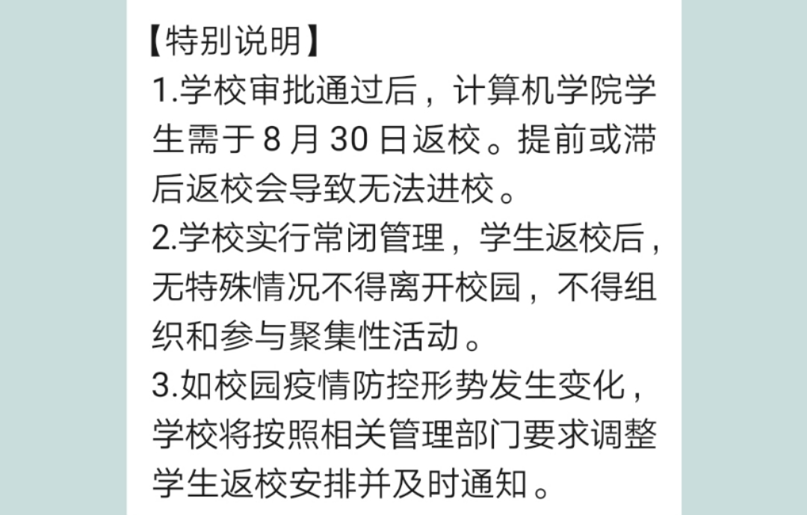
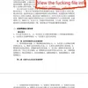
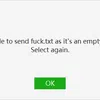

<!--
  cover image:
  - ratio: 13:6 (2340:1080)
  - top-corner: 50px
  - save-as: 1920px webp

  single image:
  /* be sure to add hyperlink to raw file manually */
  - width: 200px
  -->

<table width="100%" border="0" cellpadding="30" cellspacing="0" bgcolor="transparent" align="left" frame="void">

<tr>
<td width="150" align="right">2020-08-25 21:00 #kuSCgiBreG</td>
<td>

</td>
</tr>

<tr>
<td width="150" align="right">2020-08-25 16:29 #u1JWetvIer</td>
<td>

窗外馬路上的落葉和大風突然讓我想起來高中在校道上面吹着略帶一點寒意的秋風的感覺，
那樣的風吹在臉上的感覺很真實，讓人真實地感覺自己站在這個世界上，被周圍的一切所
簇擁着

</td>
</tr>

<tr>
<td width="150" align="right">2020-08-24 23:06 #kQZqf4jZkJ</td>
<td>

華師的服務真的是日常出 bug ... 我改你🐴呢

</td>
</tr>

<tr>
<td width="150" align="right">2020-08-24 01:43 #GG8tnEdcfE</td>
<td>

返校倒計時七天

</td>
</tr>

<tr>
<td width="150" align="right">2020-08-23 15:37 #IdF57WKjFo</td>
<td>

微軟寧是真牛逼哈，一天不做妖會死？

神 TM 無法查看所有者，刪個文件都能給你刪死了

<blockquote>
<a href="//github.com/li-zyang">li-zyang</a>: 紧接着系统界面就开始出各种 bug 
<a href="//github.com/li-zyang">li-zyang</a>: 然后重启进 PE 之后发现这个文件早就从文件系统上被删除了 
<a href="//github.com/li-zyang">li-zyang</a>: 你说刺激不刺激 
</blockquote>
</td>
</tr>

<tr>
<td width="150" align="right">2020-08-22 19:57 #EmR2I0wb9K</td>
<td>

這是八月份的 6000 字／天

</td>
</tr>

<tr>
<td width="150" align="right">2020-08-22 09:29 #G2cDKkluar</td>
<td>

今天又發現一個自己跟別人不一樣的地方呢

不只是爺爺奶奶，親媽也會這麼想，而且還很自豪呢

</td>
</tr>

<tr>
<td width="150" align="right">2020-08-21 19:16 #606CPH9JRF</td>
<td>

被全世界圍攻的一天

</td>
</tr>

<tr>
<td width="150" align="right">2020-08-21 12:49 #OhybzdTnQ9</td>
<td>

你永遠都祗是“說了幾句”，所以錯誤總是在別人身上

</td>
</tr>

<tr>
<td width="150" align="right">2020-08-20 23:26 #if573gw8yz</td>
<td>

生活艱難吶

</td>
</tr>

<tr>
<td width="150" align="right">2020-08-17 21:18 #wUeB0XXpdk</td>
<td>

又搞起 PIL 來了

就是以前用過的東西全忘了

</td>
</tr>

<tr>
<td width="150" align="right">2020-08-16 15:11 #ArW7U3aGhr</td>
<td>

早上費力半天勁把家裏的傻逼書櫃拉出來拿後面的東西，搞了一個多小時，好不容易弄完
了回來打開個 Photoshop 處理張圖片結果剛打開就報錯異常退出，還把 Firefox 也搞
崩了，重啓沒多久又崩一次，好不容易把這些破事搞完結果發現 Tampermonkey 在石墨
文檔上又沒法正常運行了，而且還找不到原因，下午喝個酸奶結果一撕包裝直接質壁分離
了，洗個杯子結果杯子直接從橡膠套裏面脫出來摔碎了

真 TM 好一天

</td>
</tr>

<tr>
<td width="150" align="right">2020-08-15 22:46 #Y6Aa3j19eL</td>
<td>

你 TM 杀了我吧

</td>
</tr>

<tr>
<td width="150" align="right">2020-08-15 13:57 #eV9AWz8Z1b</td>
<td>

搞吧，使勁搞吧，反正永遠都是“你們”家

</td>
</tr>

<tr>
<td width="150" align="right">2020-08-14 20:23 #WGeDyBLQKd</td>
<td>

做啥都專心不下來的一天

一個看起來挺小的 Proj 拖了一個多月，再不搞完都要開學了。心態爆炸。

</td>
</tr>

<tr>
<td width="150" align="right">2020-08-13 20:42 #0UQIc0neIH</td>
<td>

什么狗屎网络今天

</td>
</tr>

<tr>
<td width="150" align="right">2020-08-13 10:35 #6Xa5jAGUBg</td>
<td>

我发现街区派出所的面子工程简直是完美的闹钟，一听到就醒 
拿来当闹钟铃声了✓

<audio controls="true">
  <source src="src/CvqqQ1mYCd.mp3">
</audio>
</td>
</tr>

<tr>
<td width="150" align="right">2020-08-10 14:31 #QeZK2JOgnF</td>
<td>

md 
千万别买 <a href="https://www.socketpro.site/zh/home">Socket Pro</a> 的服务，坑死 
都 0202 年 8 月了还只支持 SSR，客服态度还横的一批

</td>
</tr>

<tr>
<td width="150" align="right">2020-08-10 14:31 #Iyg7tA9p9b</td>
<td>

想睡着难，想起床难，想不起床也难 
真难

</td>
</tr>

<tr>
<td width="150" align="right">2020-08-08 16:16 #GQyTOWICx</td>
<td>

傻逼公司做的东西真的是越来越弱智，TMD 现在移动应用也不知道是在往什么有毒的方向
发展，总喜欢没事找事去做些多余的东西，要不就是把什么东西都隐藏起来，搞得手机越
来越 JB 难用

什么叫没有安装可以打开该文件的应用？谁让你自己去判断了？？系统没提供通过默认程
序打开文件的功能吗？？有你 TM 用系统自带的行不行？？
你 TM 文件好好放个地方实在不行全放 Downloads 里面行不行？以前找半天好歹还找得
到，现在放文件的地方都没有了，你上辈子跟文件路径有仇是不？那我要你那个傻逼文件
传输助手是干嘛的？

还有些傻逼应用涉及到一点不呆逼的功能直接没有，还有某平台上的大多数应用设置里面
就一个关于，那你妈逼的还不如直接放个关于算了呢

还有我发个文件文件空不空关你屁事？我叫你检查文件内容了吗？？

还有有事没事就叫人安装个 App 这种鬼风气，你 TM 的 App 很好看咩？？一点小功能
用 Web 会死是不是？还有些只做手机端不做 PC 端的我真是祝您早日爆炸💥

</td>
</tr>

<tr>
<td width="150" align="right">2020-08-07 14:05 #kKakAEwZuH</td>
<td>

............................... 72 ch rl ............................... 
OK =_= 有啥逼話發這算了 
有事 issue 見

</td>
</tr>

</table>