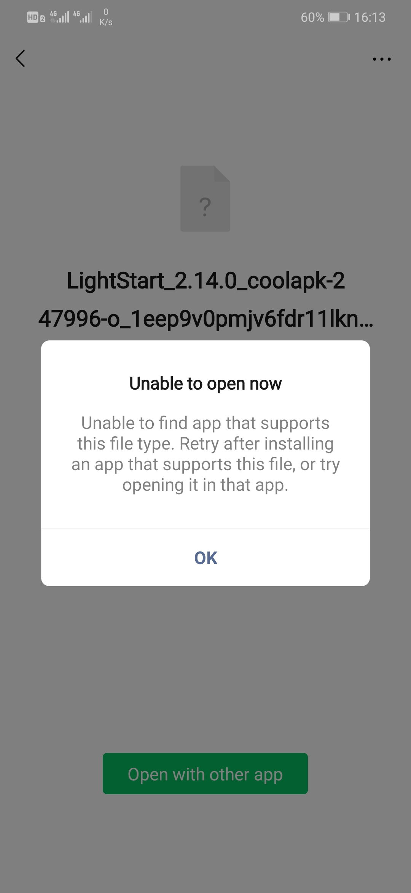
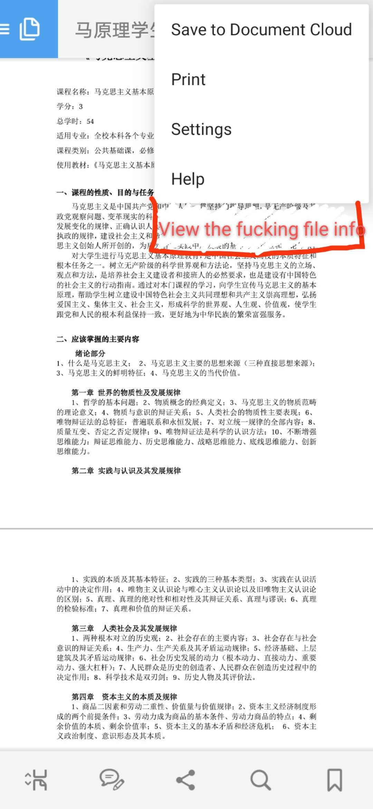
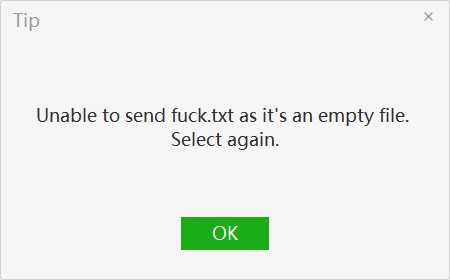

# Idlery

<table width="100%" border="0" cellpadding="30" cellspacing="0" bgcolor="transparent" align="left" frame="void">

<tr>
<td width="150" align="right">2020-08-14 20:23</td>
<td>

做啥都專心不下來的一天

一個看起來挺小的 Proj 拖了一個多月，再不搞完都要開學了。心態爆炸。

</td>
</tr>

<tr>
<td width="150" align="right">2020-08-13 20:42</td>
<td>

什么狗屎网络今天

</td>
</tr>

<tr>
<td width="150" align="right">2020-08-13 10:35</td>
<td>

我发现街区派出所的面子工程简直是完美的闹钟，一听到就醒 
拿来当闹钟铃声了✓

<audio controls="true">
  <source src="src/CvqqQ1mYCd.mp3">
</audio>
</td>
</tr>

<tr>
<td width="150" align="right">2020-08-10 14:31</td>
<td>

md 
千万别买 <a href="https://www.socketpro.site/zh/home">Socket Pro</a> 的服务，坑死 
都 0202 年 8 月了还只支持 SSR，客服态度还横的一批

</td>
</tr>

<tr>
<td width="150" align="right">2020-08-10 14:31</td>
<td>

想睡着难，想起床难，想不起床也难 
真难

</td>
</tr>

<tr>
<td width="150" align="right">2020-08-08 16:16</td>
<td>

傻逼公司做的东西真的是越来越弱智，TMD 现在移动应用也不知道是在往什么有毒的方向
发展，总喜欢没事找事去做些多余的东西，要不就是把什么东西都隐藏起来，搞得手机越
来越 JB 难用

什么叫没有安装可以打开该文件的应用？谁让你自己去判断了？？系统没提供通过默认程
序打开文件的功能吗？？有你 TM 用系统自带的行不行？？
你 TM 文件好好放个地方实在不行全放 Downloads 里面行不行？以前找半天好歹还找得
到，现在放文件的地方都没有了，你上辈子跟文件路径有仇是不？那我要你那个傻逼文件
传输助手是干嘛的？

还有些傻逼应用涉及到一点不呆逼的功能直接没有，还有某平台上的大多数应用设置里面
就一个关于，那你妈逼的还不如直接放个关于算了呢

还有我发个文件文件空不空关你屁事？我叫你检查文件内容了吗？？

还有有事没事就叫人安装个 App 这种鬼风气，你 TM 的 App 很好看咩？？一点小功能
用 Web 会死是不是？还有些只做手机端不做 PC 端的我真是祝您早日爆炸💥

<table>
  <tr>
    <td width="100" height="100"></td>
    <td width="100" height="100"></td>
    <td width="100" height="100"></td>
  </tr>
</table>
</td>
</tr>

<tr>
<td width="150" align="right">2020-08-07 14:05</td>
<td>

............................... 72 ch rl ............................... 
OK =_= 有啥逼話發這算了 
有事 issue 見

</td>
</tr>

</table>